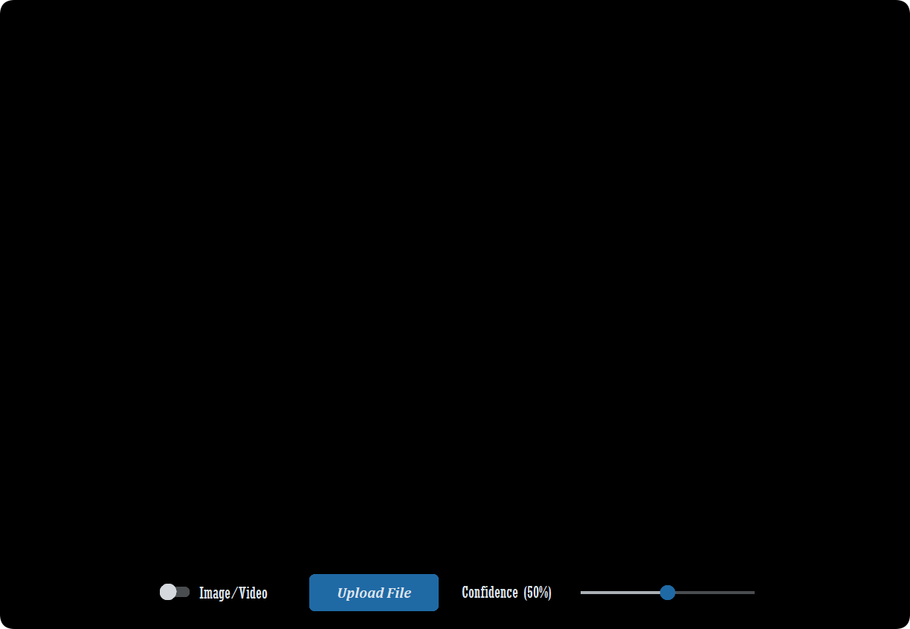

# FIRE DETECTION GUI APPLICATION

    <em>
        Fire Detection GUI Application is a sophisticated and user-friendly tool designed to assess the fire detection capabilities of the YOLO model. It allows users to seamlessly upload an image or video from their system or use a webcam for real-time detection. Upon uploading the media, the application processes the content and visually presents the results by marking detected objects, such as fire or smoke, with bounding boxes and their corresponding labels. Additionally, each detection is accompanied by a confidence score, providing insight into the model's certainty. The webcam functionality elevates the application by enabling users to assess the model's performance in dynamic, live environments, ensuring consistent and accurate fire detection across diverse conditions.
    </em>

